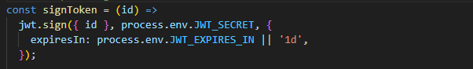
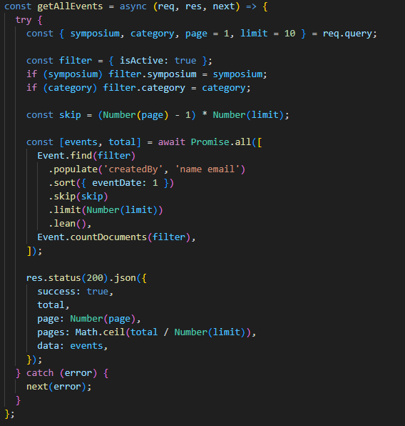
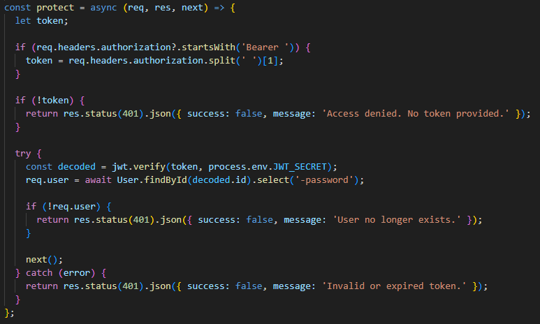
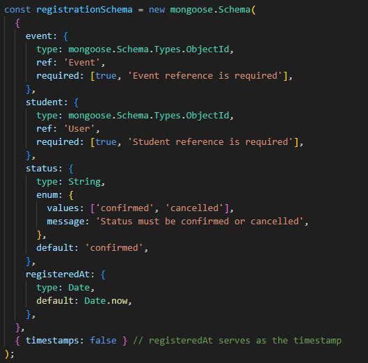
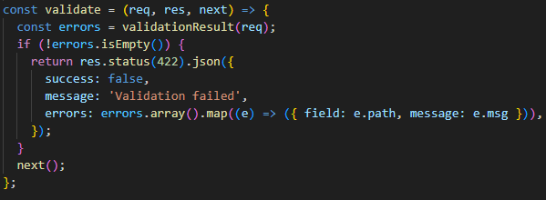
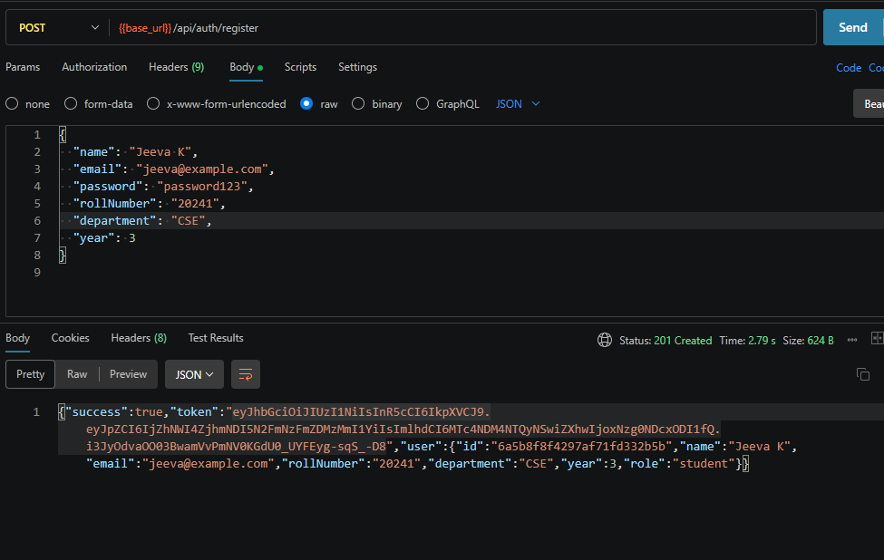
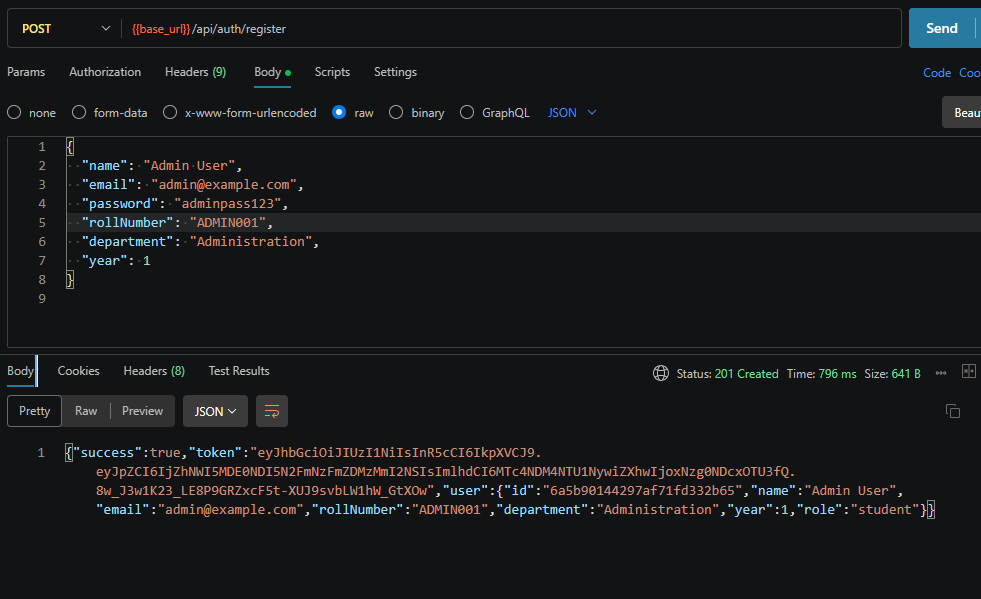
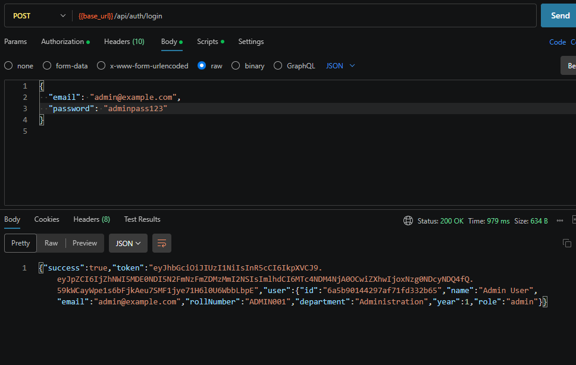
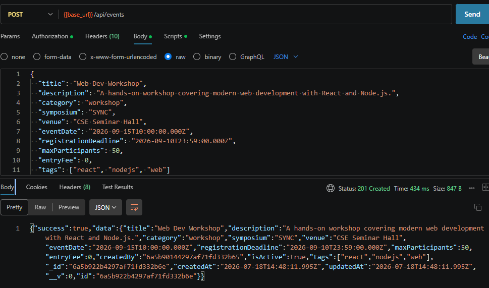
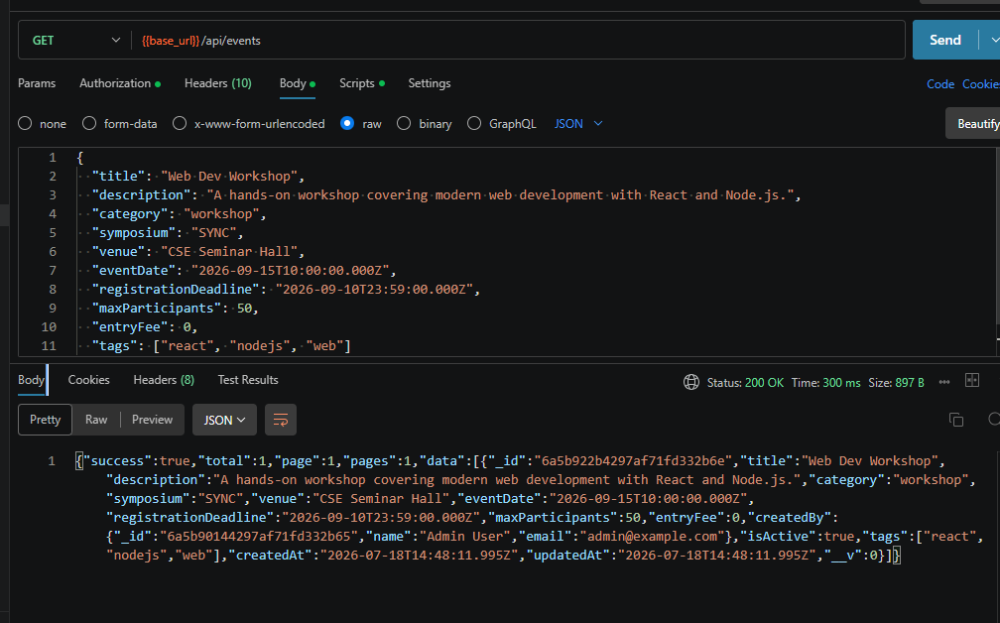

# CSEA Event Management System — Backend API

Backend REST API for the Computer Science and Engineering Association (CSEA), CEG to manage technical symposiums (SYNC, ABACUS etc..) and student registrations.

---

## Tech Stack Used

| Layer | Technology | Version |
|---|---|---|
| Runtime | Node.js | ≥ 18 |
| Framework | Express.js | 4.x |
| Database | MongoDB (Atlas / Local) | 8.x (Mongoose ODM) |
| Authentication | JSON Web Token (JWT) | 9.x |
| Password Hashing | bcryptjs | 2.x |
| Input Validation | express-validator | 7.x |

---

## Database Used

**MongoDB** — NoSQL document database.

**Primary:** MongoDB Atlas (Cloud) — no local installation needed; connect via URI in `.env`.  
**Fallback:** Local MongoDB — change `MONGO_URI` in `.env` to `mongodb://localhost:27017/csea_events`.

## Setup and Execution Instructions

### Prerequisites
- Node.js ≥ 18 installed
- MongoDB Atlas account (free tier) **or** local MongoDB installed

### 1. Clone the Repository

```bash
git clone <repo-url>
cd backend
```

### 2. Install Dependencies

```bash
npm install
```

### 3. Configure Environment Variables

```bash
# Copy the template file
cp .env.example .env
```

Open `.env` and fill in:

```env
PORT=5000
NODE_ENV=development

# MongoDB Atlas (recommended)
MONGO_URI=mongodb+srv://<user>:<password>@cluster0.xxxxx.mongodb.net/csea_events?retryWrites=true&w=majority

# OR local MongoDB fallback
# MONGO_URI=mongodb://localhost:27017/csea_events

JWT_SECRET=your_long_random_secret_here
JWT_EXPIRES_IN=1d
```

### 4. Run the Server

```bash
# Development mode (auto-restart on file changes)
npm run dev

# Production mode
npm start
```

Server runs at: `http://localhost:5000`  
Health check: `GET http://localhost:5000/api/health`

### 5. Create an Admin User

All registered users default to the `student` role. To promote a user to admin, run in MongoDB shell or Atlas:

```js
db.users.updateOne({ email: "admin@example.com" }, { $set: { role: "admin" } })
```

## Screenshots


Signed token


GetAllEvents


Protect (JWT)


Registeration


Auth Validation


 ----------------------- API CALLS ----------------------

Register student


Register Admin


Student Login


Admin Login


Create event by admin


Get all events

